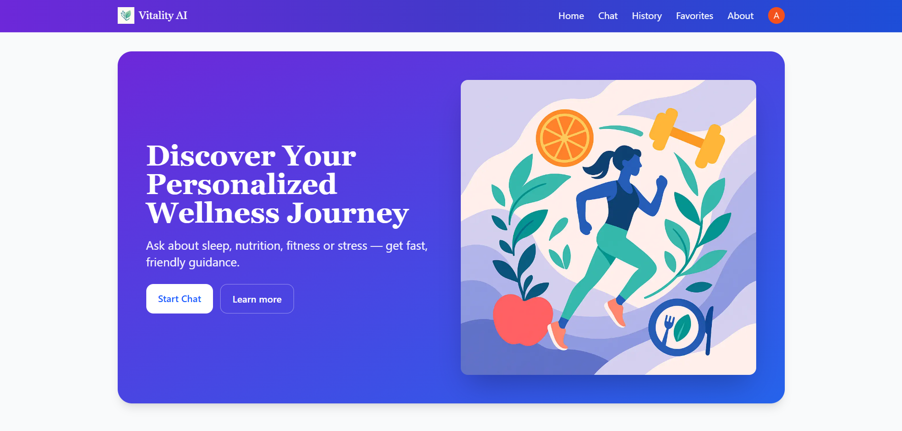
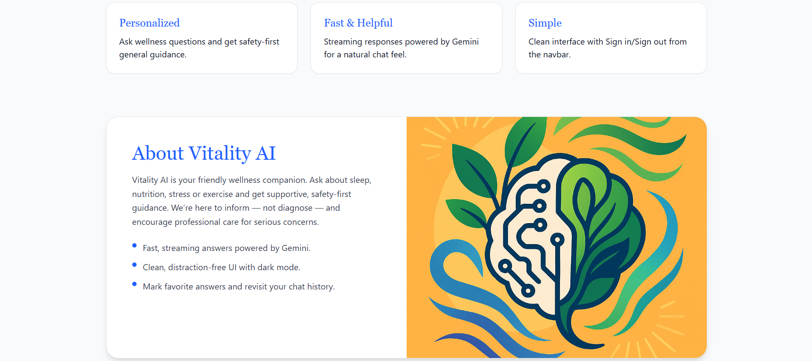
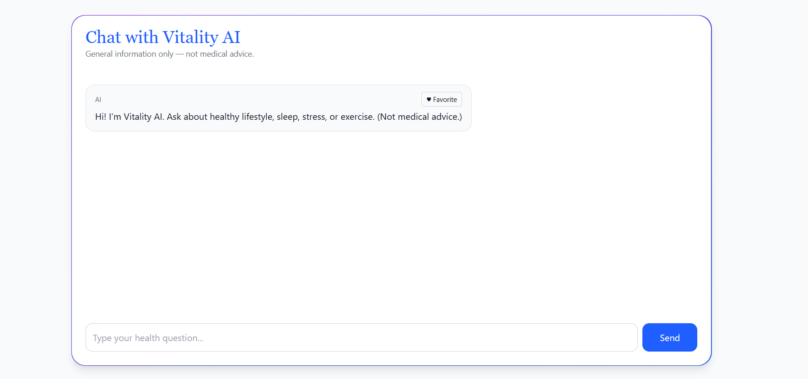
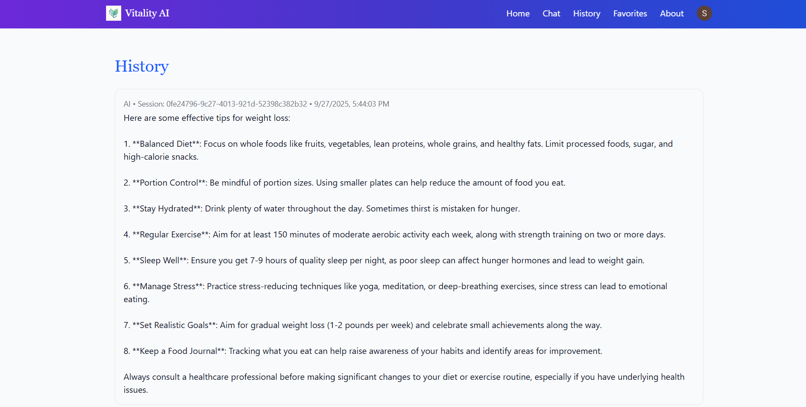
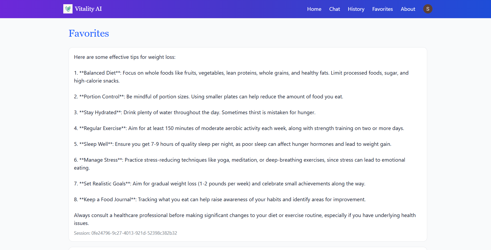

# 🌱 Vitality AI — Wellness Assistant Platform

Vitality AI is a full-stack web platform where users can **chat with an AI health & wellness assistant** powered by **Gemini AI**. It supports **chat history, favorites, Clerk authentication, and Firestore persistence** — all in a clean, responsive Next.js + Tailwind UI.

---

## 🚀 1. Project Setup & Demo

### Run Locally
```bash
git clone https://github.com/your-username/vitality-ai.git
cd vitality-ai
npm install
npm run dev
Then open http://localhost:3000 in your browser.
```

## 🧠 2. Problem Understanding
We needed to build an AI-driven wellness platform where users can:

Chat with an AI assistant for lifestyle guidance (diet, stress, sleep, exercise).

Save favorite responses and revisit chat history.

Ensure safety-first advice (no diagnosis, encourage professional consultation).

Assumptions:

Users seek general guidance not medical prescriptions.

Responses should be concise, engaging, and safe.

Persistence via Firestore ensures chats/favorites are not lost.

## 💡 3. AI Prompts & Iterations
We iterated on system prompts for Open Ai:

Initial prompt: Too verbose and clinical.

Refined prompt: Friendly tone, focus on lifestyle, added safety disclaimer.

Final prompt used:

sql
Copy code
You are Vitality AI — a friendly wellness assistant.
Offer general information on lifestyle (diet, sleep, stress, fitness) and safety-first guidance.
Do NOT diagnose or prescribe. Encourage professional care for serious symptoms.
Keep answers concise and readable.
## 🏗️ 4. Architecture & Code Structure
Framework: Next.js + Tailwind CSS + shadcn/ui

AI Layer: Open AI API

Auth: Clerk (@clerk/nextjs)

Database: Firestore (chat sessions, messages, favorites)

State Mgmt: React Context + hooks

Key Directories

bash
Copy code
app/                 # Next.js app router
 ├── api/            # API routes (chat, favorites, history)
 ├── chat/           # Chat page
 ├── favorites/      # Favorites page
 ├── history/        # History page
components/          # Reusable UI components
context/             # Context providers (chat state)
lib/                 # Firebase, AI, and Clerk configs
public/images/       # Hero, about, and feature illustrations
## 🖼️ 5. Screenshots
### Hero Section

### About Page

### Chat Page

### History Page

### Favorites Page

## 🐞 6. Known Issues / Improvements
Improve AI streaming for smoother typing effect.

Optimize Firestore rules for scalability.

Add multi-language support.

## 🎁 7. Bonus Work
⭐ Favorites system

📜 Chat history persistence

🎨 Custom illustrations & animations

🔐 Clerk-powered authentication
